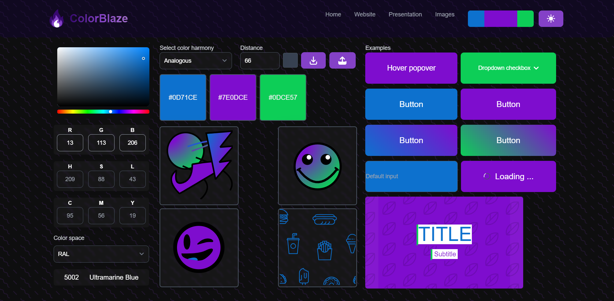
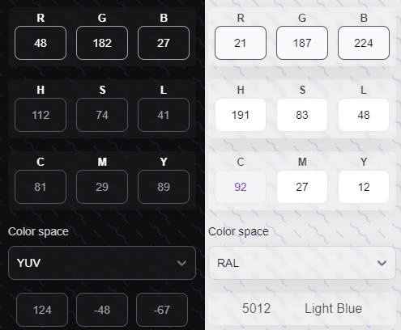
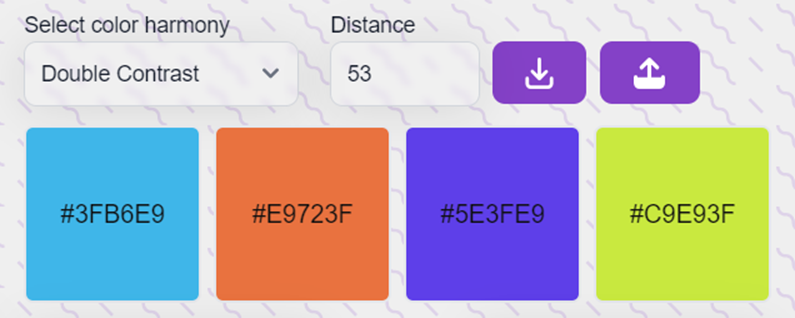
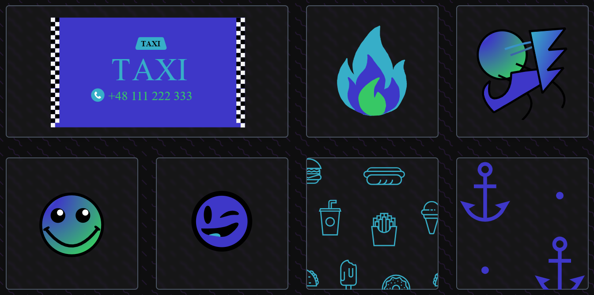
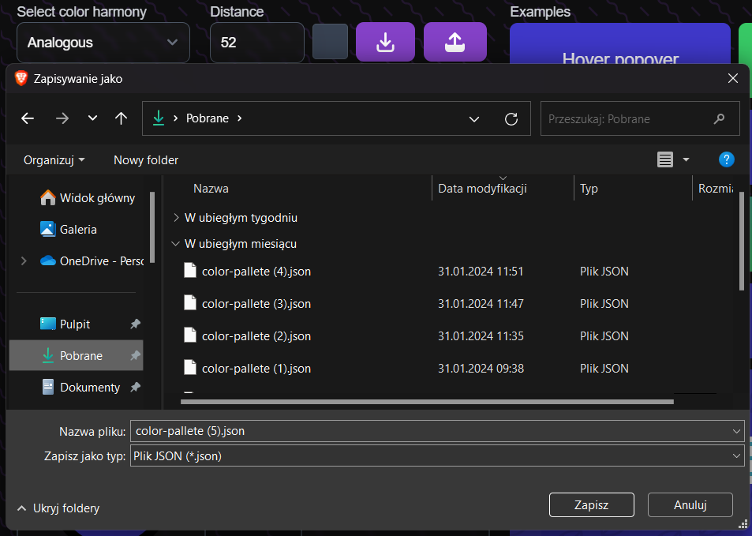

# Color Blaze

## About

Color Blaze is a vibrant and user-friendly application designed for creating and modifying color palettes. With its intuitive interface and powerful features, Color Blaze empowers users to unleash their creativity and craft visually stunning color schemes for various projects.



## Key Features

- **Color Conversion:** Effortlessly convert colors between different color systems such as HEX, RGB, HSL, and more, providing versatility and flexibility in your color selection process.



- **Suppportes color spaces:** RGB, HSL, CMY, YUV, YIQ, CIEXYZ, CIELab, CIELUV, HEX, NCS and RAL.

- **Palette Creation:** Dive into the world of color harmony and expression by creating custom color palettes tailored to your project's needs. With intuitive tools and features, crafting visually stunning palettes has never been easier.



- **Real-life Previews:** Visualize your created palettes in real-life examples, whether it's on a website, in a presentation, or within abstract graphics. Experience the true essence of your color choices before finalizing your designs.



- **Export Functionality:** Seamlessly export your generated color palettes to share them with others or integrate them into your preferred design tools. Collaborate and communicate effortlessly with colleagues and clients using your meticulously crafted color schemes.



## User Experience

Color Blaze offers unparalleled convenience and a seamless user experience.

- **Smooth Interface:** Navigating through the Color Blaze app is effortless and intuitive, enabling users to swiftly generate color palettes without any hassle.

- **Real-time Visualization:** Users can effortlessly visualize their created color palettes in real-time within various contexts, such as presentations, abstract graphics, and sample websites. This feature provides valuable insight into how the colors will appear in practical use.

- **Effortless Export:** Once a color palette is generated, users can seamlessly export it using the Color Blaze app, simplifying the process of sharing their meticulously crafted palettes with others.


## Technologies used
```
Svelte
Tailwind
Flowbite
```